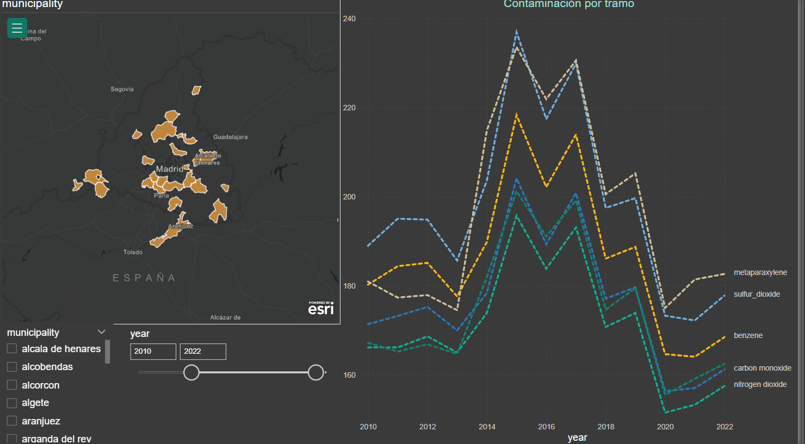
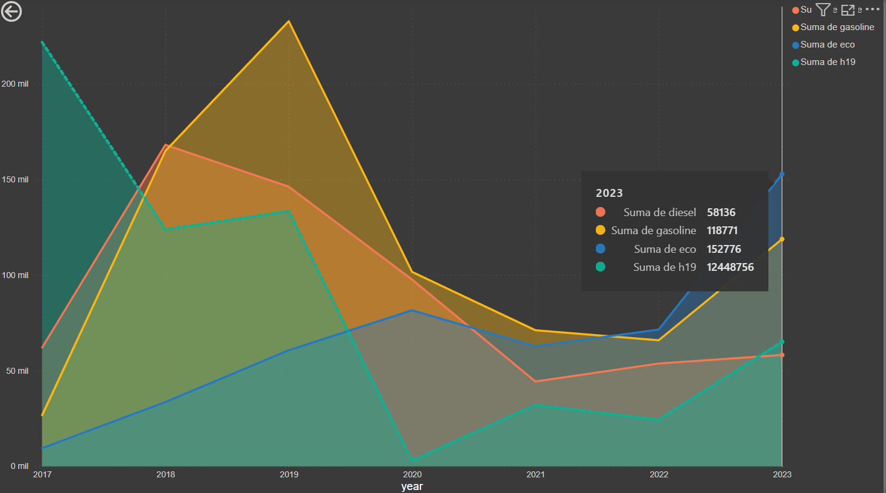
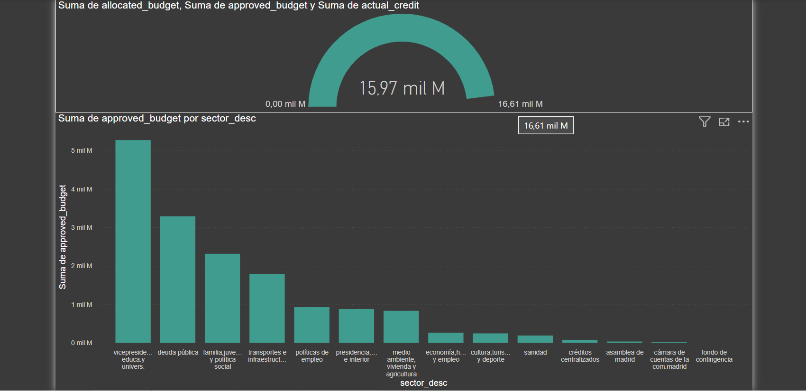

# Inhale-the-present-exhale-the-past.-
In Madrid the ZBE and ZBEDEP were created by the ANM 2023\152 ordenance, this law based on other several ones aims to improve the air quality, and the life of all of Madrid's resident.  This proyect has been called a farse, classist and useless aswell as neccessary, crucial and the best thing that has happened to the city. But which one is right.

We can observe that as our EDA confirmed pollution has been overall declining with a massive spike downwards in Covid's 2020 lockdown. Furthermore we see that currently the recent efforts by the goverment has not yet proved succesfull but as more restrictions roll in and the volume of cars are reduced they will go down.

Fuel efficient cars and electric cars are two sides of the same coin, our EDA on the residual data comparing the overall pollution per decade and the sales of the different types of pollution discovers that gasoline isnt as polluting as we thought and maybe our solution should be focused towards walkable cities and public transit.

This final study shows how abandoned are the policies that focuses on that part of the Hipothesis,pollution has descended, but our budget allocation doesnt match with our supposed goal per final date to achieve it, with minimal resource allocation and little to no investment in public transit the city pollution problem with only worsens as it grows.

This project was made to reinforce the idea that half baked eco solutions by goverments and local authorities doesnt fix the underlaying issue of overpopulation in cities with poor public transit and that we all need to do more, specially the upper side of the social pyramid.
